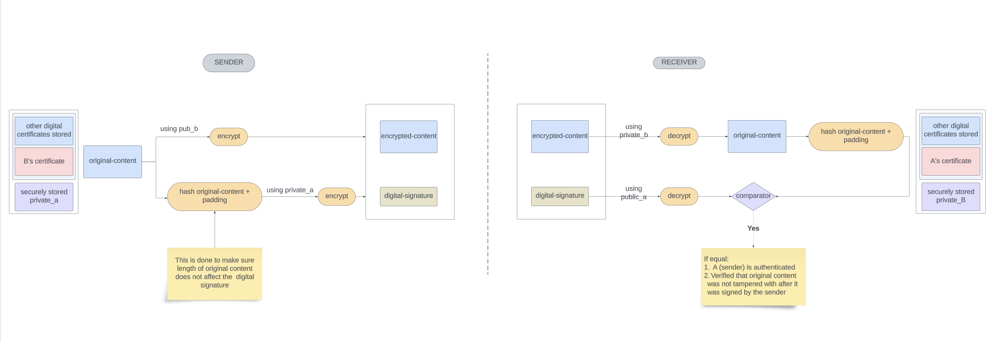

# Asymmetric Key Encryption

## Introduction

We want to make sure that whatever communication happens between a sender and receiver over the internet is secure. By secure communication, we want to make sure these 2 requirements are fulfilled:

1. ***Only*** the intended party (`receiver` / `relying party`) is able to read the original content
2. Intended party is able to validate that the message is in fact from the said receiver, i.e a way to authenticate sender

To ensure this we use something called asymmetric key encryption (it’s at the core of all the security protocols).

In AKE, a pair of keys are mathematically generated using one of the algorithms available (the likes of `RSA, ecdsa, ed25519`), one is called public key and one is called private key.

## Properties of Public Private Key Pair

- These keys are mathematically related and theoretically one can be generated from another, practically though this is considered as impossible due to  computational limitations
- Content encrypted with one key can `only` be decrypted with the other key of the pair

## Secure Communication

With the above properties of asymmetric keys, we can establish a secure communication process as illustrated in the following diagram

- we decrypt the encrypted content, hash and pad it again
- we decrypt the sender’s signature using sender’s certificates / sender’s public key
- we compare above to entities, if they are same, this proves that
    - identity of sender is verified and that it is what it claims to be
    - if the original content was tempered with, the hashed value generated from decrypted content would have been different from that of value generated after decrypting sender’s signature, hence we also verify that original content was not modified after sender signed it

However, it comes with an additional concern that we need to address.

The process relies on the fact that receiver has access to sender’s public key that will be used to decrypt the encrypted content. But there has to be a way to make sure we can trust that the key is in fact, A’s public key only.

That’s where certificates come into the picture

In simple terms, **a certificate can be considered as a public key with the owner’s identity attached with it.**
In addition it also contains the identity of the certificate issuing entity

All senders need to get a certificate generated from a Certificate Issuing Authority (CAs).

These authorities in turn needs to be verified by the `Root CA`

Root certificates are preinstalled by the vendors such as Microsoft etc… and are trusted by the system.

So while verifying sender’s identity:

1. we compare hashes that are generated by
    1. applying pre-defined hash and padding functions on original content
    2. decrypting sender’s digital signature using it’s certificate
2. For doing that we need to verify that sender’s certificate can be trusted
3. For that we need to verify the identity of certificate’s issuer
4. For that we need to verify it’s issuer and so on…
5. Until we find a certificate that is actually issued by a Root CA that our system trusts.
6. Bingo! now we use `step 1` to verify the certificate and move upwards until we verify that the sender’s certificate can be trusted
7. Eventually we use step 1 to verify the sender of the content.

Above process is called certificate chain validation!

> There was also symmetric key encryption, which basically uses a single key to encrypt and decrypt the content.
But this comes with the overhead of making sure the single key is distributed to receivers in a secure way…
> 

## Resources

Found the below resource very helpful to understand how Asymmetric Encryption is actually securing communications

Preferably read / watch in this order only

[https://youtu.be/q9vu6_2r0o4](https://youtu.be/q9vu6_2r0o4)

[https://youtu.be/GSIDS_lvRv4](https://youtu.be/GSIDS_lvRv4)

[https://www.youtube.com/watch?v=s22eJ1eVLTU](https://www.youtube.com/watch?v=s22eJ1eVLTU)

[https://youtu.be/L1GkEnftoRQ](https://youtu.be/L1GkEnftoRQ)

[https://youtu.be/lLw0dICMA_Y](https://youtu.be/lLw0dICMA_Y)

[small online demo of asymmetric encryption/decryption](https://www.devglan.com/online-tools/rsa-encryption-decryption)