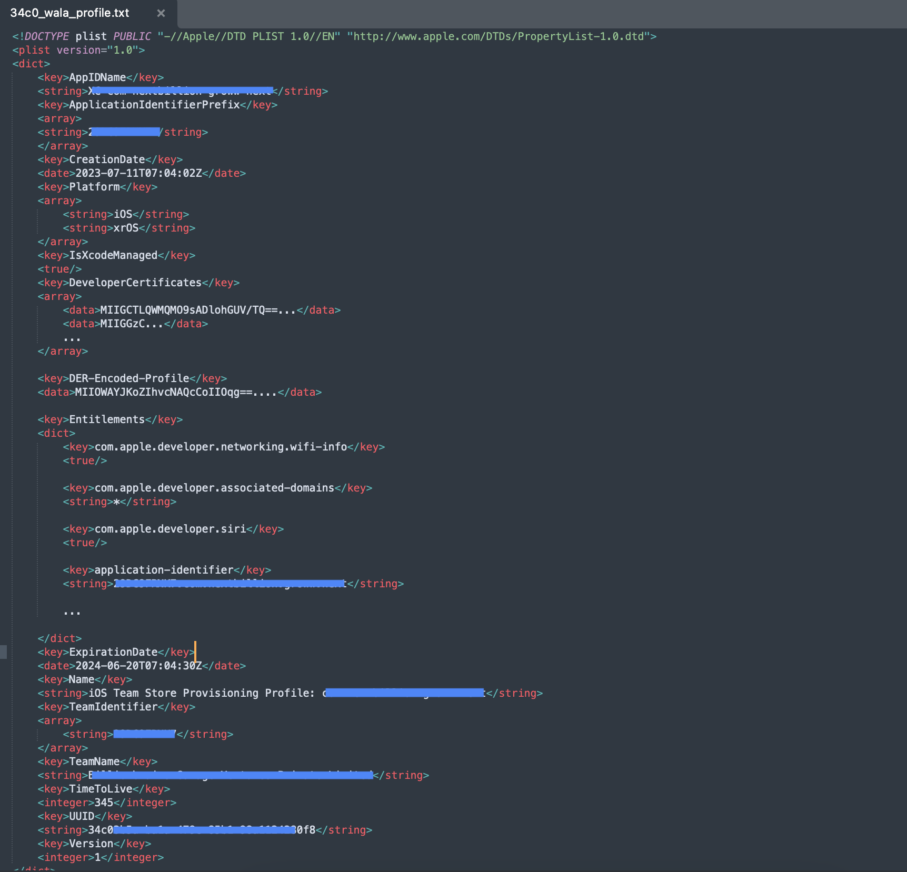
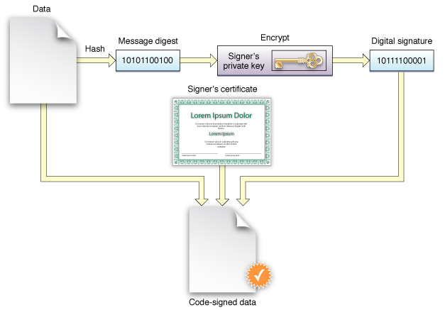

# Apple Provisioning Profiles and Certificates

Unlike Android, you can’t install any app on an iOS device. It has to be signed by Apple first. However, when you’re *developing* an app, you probably want to test it before sending it to Apple for approval. Provisioning profile act as a link between the device and the developer account.

So Apple needs a way to make sure that the developer trying to install an app on a device is authorised to do so.

That’s where provisioning profiles come into picture

> ***Apple’s definition**:
A provisioning profile is a collection of digital entities that uniquely ties developers and devices to an authorised iPhone Development Team and enables a device to be used for testing.*
> 

The provisioning profile needs to be downloaded from Apple Developer Portal and new devices need to be added on the portal first to install apps on them.

However, Xcode Automatic Signing simplifies and creates / updates provisioning profiles, certificates, App Ids etc.. when enabled

While installing an app on a device, a provisioning profile is also embedded with the bundle.

Based on the profile, several checks are run before the app can be launched on the said device.

If any of these checks fail, the app won’t launch on the device (stays greyed out)

## Provisioning Profile

There are different types of provisioning profiles, mainly Development, Ad-Hoc Distribution, Enterprise and App Store Distribution

Provisioning profiles contain following important meta-data

### App ID

This is a two part string containing:

1. `ApplicationIdentifierPrefix` (`team-id`) - 29DC9FRNK7
2. AppIDName ( kind of bundle identitifer)- XC com nextbillion groww stage

It can also contain wildcards `(*)` to mention multiple bundle identifiers for the same team

### Developer Certificates

This contains certificates that are used to authorise the developer trying to install app on a device

It contains list of certificates

### Entitlements

What all services the said app can access | What all permissions etc…

eg. 

`com.apple.developer.siri` - `true`

`get-task-allow` - `true`

### Provisioned Devices

Array of unique device ids on which development builds can be installed

* App Store Distribution Profiles do not have list of provisioned devices

Among other such as `Creation and Expiration Date of Profile , TeamName, profile UUID`

Refer **[Asymmetric Key Encryption](https://github.com/vaidyakhil/Good-Reads/blob/master/miscellaneous/asymmetric_key_encryption/AsymmetricKeyEncryption.md)** to understand basics of Public Key Encryption and certificates

To make sure that the build was in fact generated by the said developer and that it hasn’t been tampered with after the developer generated it, builds are code-signed and verified before installation.

## Resources

- [https://abhimuralidharan.medium.com/what-is-a-provisioning-profile-in-ios-77987a7c54c2](https://abhimuralidharan.medium.com/what-is-a-provisioning-profile-in-ios-77987a7c54c2)
- [https://www.runway.team/blog/ios-certificates-provisioning-profiles-large-teams](https://www.runway.team/blog/ios-certificates-provisioning-profiles-large-teams)
- [https://stackoverflow.com/a/17603913/7930262](https://stackoverflow.com/a/17603913/7930262) (To decrypt and read a profile)
- [https://developer.apple.com/forums/thread/100614](https://developer.apple.com/forums/thread/100614)